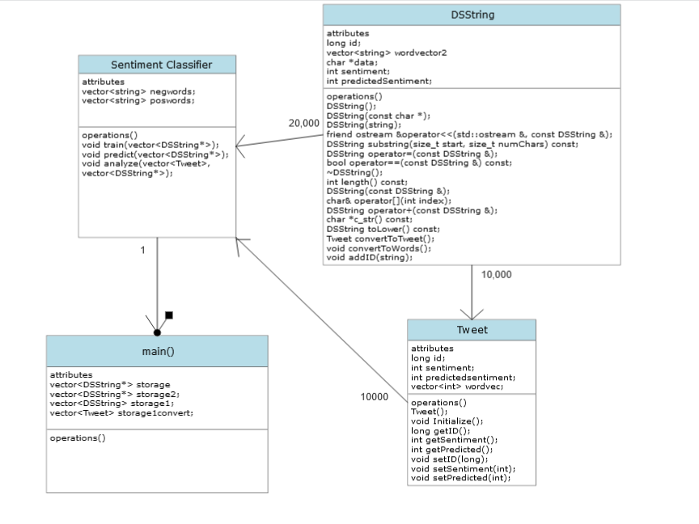

# Assignment 2: Answers

**Complete this document, commit your changes to Github and submit the repository URL to Canvas.** Keep your answers short and precise.

Your Name: Ethan Seem

Used free extension: [ ] 24 hrs or [ ] 48 hrs

[ ] Early submission (48 hrs)

[ ] Bonus work. Describe: ...

Place [x] for what applies.

## UML Diagram

Add your UML class diagram here.

Replace the following image with your diagram. You can draw it by hand and take a photo.

## Answers

1. How do you train the model and how do you classify a new tweet? Give a short description of the main steps.

    > First, I separated all of the tweets by their sentiment. Then, I would add every single word to a vector of "negative" and "positive" words. Then I would delete all words in common between the two vectors to eliminate "neutral" words. If a tweet had a majority of "negative" words, it would be marked negative and vice versa. If a tweet is completely neutral, it would be marked positive. (found to be more accurate than always negative.). I also tried out using weighted randomization to determine sentiment, but it ended up less accurate.

2. How long did your code take for training and what is the time complexity of your training implementation (Big-Oh notation)? Remember that training includes reading the tweets, breaking it into words, counting, ... Explain why you get this complexity (e.g., what does `N` stand for and how do your data structures/algorithms affect the complexity).

   > It took between 10-15 minutes on my PC (I missed exactly when it happened). In terms of big O notation, I believe it is O(N^2). Reading tweets = O(n), Breaking into words is O(n), Adding every word to a positive/negative vector is O(n), sorting vectors is O(n^2), comparing each positive/negative word is O(n^2). N = number of times you have to read through the data per entry.

3. How long did your code take for classification and what is the time complexity of your classification implementation (Big-Oh notation)? Explain why.

   > A lot less time, about 5 minutes. It's O(n^2), because it just goes through each tweet's words and sees if they are present in either the positive or negative vectors. It's two times each piece of data has to iterate through it.

4. How do you know that you use proper memory management? I.e., how do you know that you do not have
   a memory leak?

   > You can use valgrind to verify any memory leaks. In addition, to make sure you have proper memory management, every time you use the "new" keyword, make sure it gets deleted somewhere.

5. What was the most challenging part of the assignment?

   > Before I asked the help desk and they suggested using std::getline(), It was reading in the tweets. After that, it was probably training the model (identifying positive and negative words). I researched and learned about sets (about halfway through creating SentimentClassifier.cpp) which greatly helped in making the datasets clearer.

6. Extra notes:

   >I made a separate repository called "DBSREBUILD" because I ended up starting over from scratch (because I was having some problems getting it to run on my main PC). It doesn't have some files that I deemed unnecessary like test_DSString.cpp. I just wanted to clarify in case it was confusing that the repository has a strange name.